# CODE PLANTUML POUR GÉNÉRER LES DIAGRAMMES

Ce fichier contient le code PlantUML pour générer tous les diagrammes UML du projet.
Vous pouvez utiliser ces codes dans les outils listés à la fin de ce document.

---

## 1. DIAGRAMME DE CAS D'UTILISATION GLOBAL

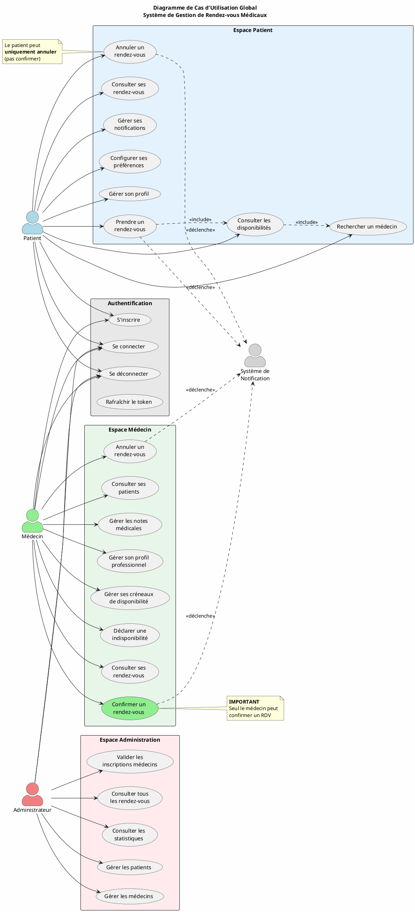

---

## 2. DIAGRAMME DE CAS D'UTILISATION - PATIENT

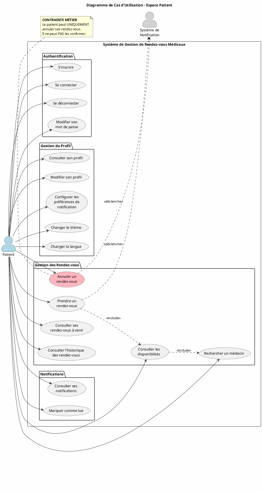

---

## 3. DIAGRAMME DE CAS D'UTILISATION - MÉDECIN

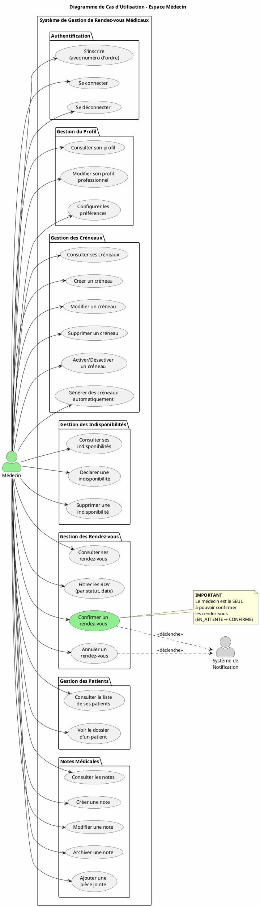

---

## 4. DIAGRAMME DE CAS D'UTILISATION - ADMINISTRATEUR

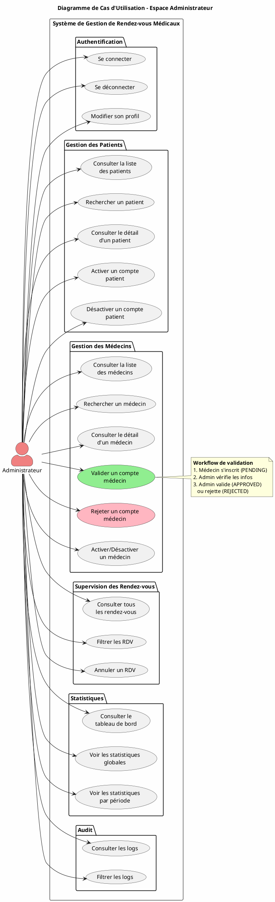

---

## 5. DIAGRAMME DE CLASSES

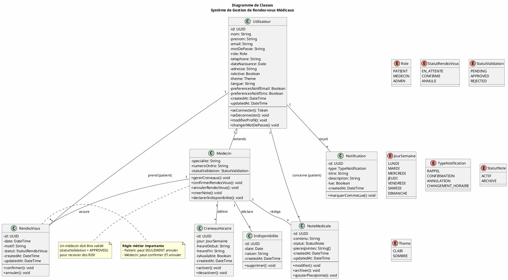

---

## 6. DIAGRAMME DE SÉQUENCE - PRISE DE RENDEZ-VOUS

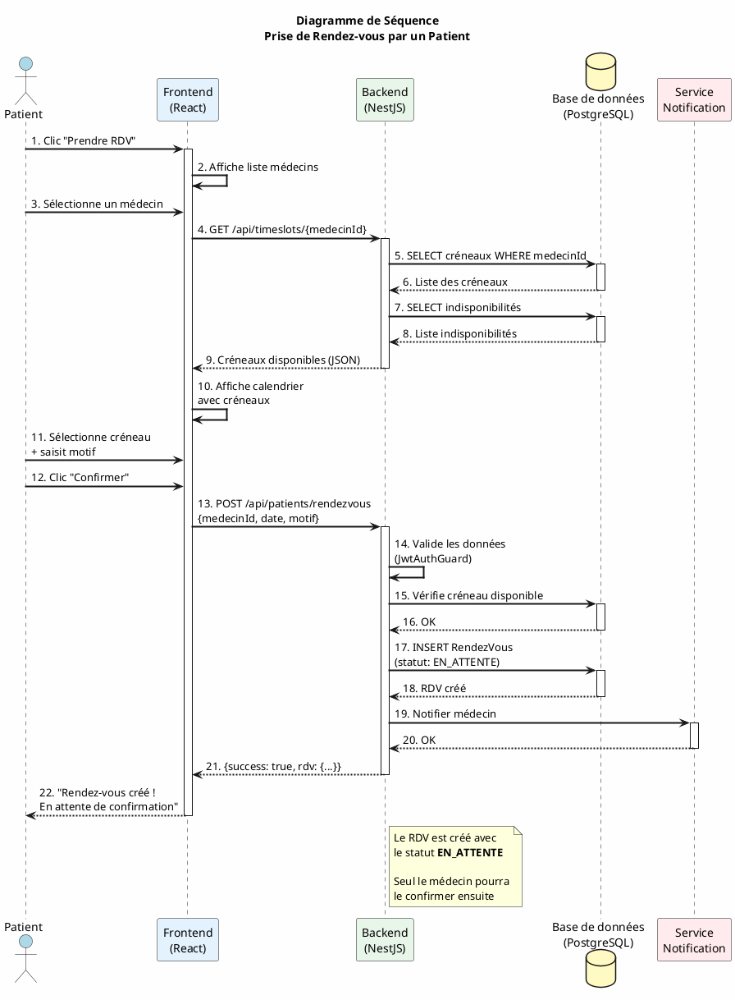

---

## 7. DIAGRAMME DE SÉQUENCE - CONFIRMATION PAR MÉDECIN

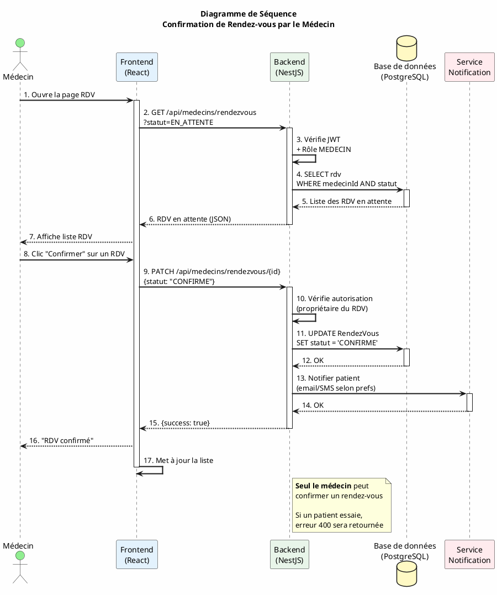

---

## 8. DIAGRAMME DE SÉQUENCE - AUTHENTIFICATION

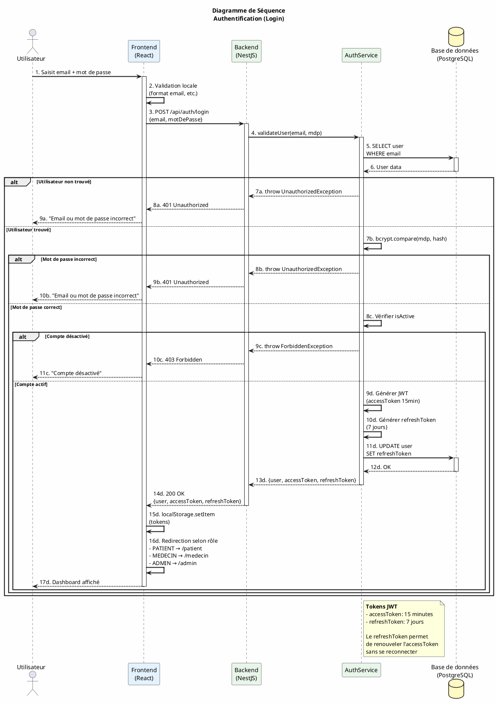

---

## 9. MODÈLE CONCEPTUEL DE DONNÉES (MCD) - MERISE

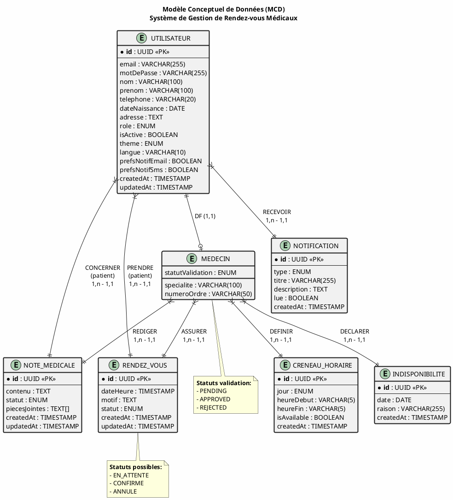

---

## 10. DIAGRAMME ENTITÉ-RELATION (ERD)

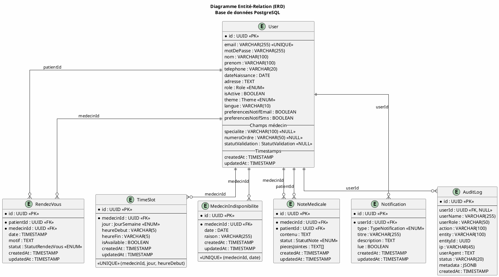

---

## 11. ARCHITECTURE TECHNIQUE

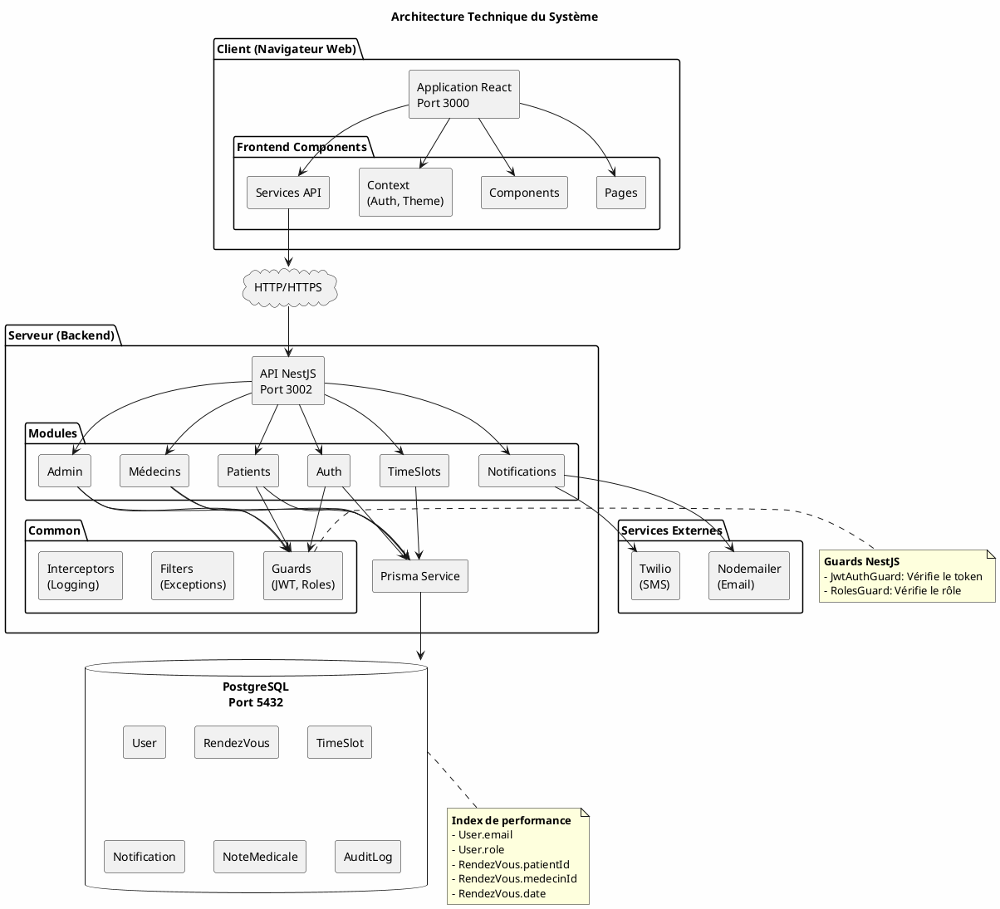

---

# OUTILS RECOMMANDÉS POUR CRÉER LES DIAGRAMMES

## 1. Outils en ligne (GRATUITS)

### PlantUML Online
- **URL**: https://www.plantuml.com/plantuml/uml
- **Utilisation**: Copier-coller le code PlantUML ci-dessus
- **Export**: PNG, SVG, PDF

### Draw.io (Diagrams.net)
- **URL**: https://app.diagrams.net/
- **Utilisation**: Glisser-déposer pour créer des diagrammes
- **Export**: PNG, SVG, PDF, JPEG
- **Avantage**: Très facile à utiliser, templates UML disponibles

### Lucidchart (version gratuite limitée)
- **URL**: https://www.lucidchart.com/
- **Export**: PNG, PDF
- **Avantage**: Interface professionnelle

### Creately
- **URL**: https://creately.com/
- **Export**: PNG, PDF
- **Avantage**: Bon pour les diagrammes de cas d'utilisation

## 2. Logiciels de bureau (GRATUITS)

### StarUML
- **Téléchargement**: https://staruml.io/
- **Plateformes**: Windows, macOS, Linux
- **Avantage**: Très complet pour UML

### Dia
- **Téléchargement**: http://dia-installer.de/
- **Plateformes**: Windows, macOS, Linux
- **Avantage**: Simple et léger

### ArgoUML
- **Téléchargement**: https://argouml.en.softonic.com/
- **Plateformes**: Windows, macOS, Linux (Java)
- **Avantage**: Open source, standard UML

## 3. Outils spécifiques MCD/Merise

### Looping (RECOMMANDÉ pour MCD)
- **Téléchargement**: https://www.looping-mcd.fr/
- **Plateforme**: Windows
- **Avantage**: Spécialement conçu pour MCD/MLD Merise
- **Note**: LE MEILLEUR pour les schémas Merise français

### JMerise
- **Téléchargement**: https://www.jfreesoft.com/JMerise/
- **Plateformes**: Windows, macOS, Linux (Java)
- **Avantage**: Gratuit, pensé pour Merise

### DBDesigner 4
- **Téléchargement**: Rechercher "DBDesigner 4"
- **Plateforme**: Windows
- **Avantage**: Ancien mais efficace

## 4. Extensions VS Code

### PlantUML Extension
- **ID**: jebbs.plantuml
- **Utilisation**: Prévisualiser le code PlantUML directement dans VS Code
- **Raccourci**: Alt+D pour prévisualiser

### Draw.io Integration
- **ID**: hediet.vscode-drawio
- **Utilisation**: Créer des diagrammes Draw.io dans VS Code

## 5. Export et qualité d'image

Pour un mémoire professionnel, utilisez ces paramètres:
- **Format**: PNG ou PDF
- **Résolution**: 300 DPI minimum
- **Taille**: Adapter pour impression A4
- **Police**: Lisible (12pt minimum)

## PROCÉDURE RECOMMANDÉE

1. **Pour les diagrammes UML** (cas d'utilisation, séquence, classes):
   - Utiliser https://www.plantuml.com/plantuml/uml
   - Copier le code PlantUML de ce fichier
   - Télécharger en PNG (haute résolution)

2. **Pour le MCD/MLD**:
   - Télécharger Looping (Windows) ou JMerise
   - Créer le schéma visuellement
   - Exporter en image

3. **Pour l'architecture**:
   - Utiliser Draw.io
   - Créer le schéma manuellement
   - Exporter en PNG/PDF

---

*Document généré pour faciliter la création des diagrammes du mémoire*
