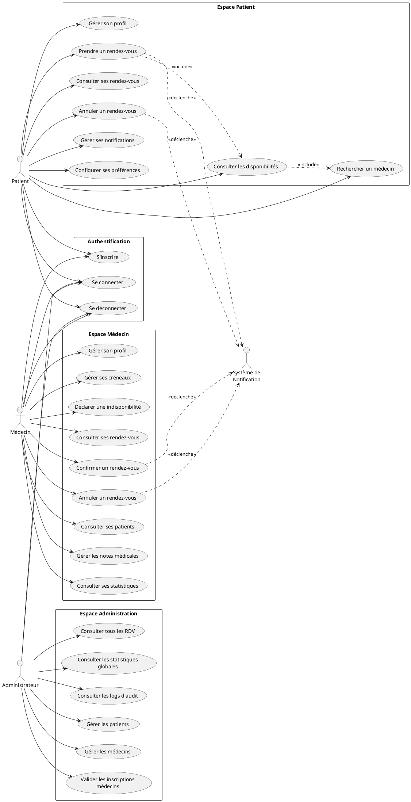

# Diagramme de Cas d'Utilisation - Système de Gestion de Rendez-vous Médicaux

## Acteurs du Système

### Acteurs Principaux
1. **Patient** - Utilisateur qui prend des rendez-vous médicaux
2. **Médecin** - Professionnel de santé qui gère ses consultations
3. **Administrateur** - Gestionnaire du système

### Acteurs Secondaires
4. **Système de Notification** - Envoie des emails et SMS automatiques
5. **Système d'Authentification** - Gère la sécurité et les accès

---

## Cas d'Utilisation par Acteur

### 🔐 AUTHENTIFICATION (Tous les acteurs)

| Code | Cas d'Utilisation | Description |
|------|-------------------|-------------|
| AUTH-01 | S'inscrire | Créer un nouveau compte (Patient ou Médecin) |
| AUTH-02 | Se connecter | Accéder au système avec email/mot de passe |
| AUTH-03 | Se déconnecter | Terminer la session |
| AUTH-04 | Rafraîchir le token | Renouveler automatiquement la session |
| AUTH-05 | Réinitialiser mot de passe | Demander un nouveau mot de passe |

---

### 👤 PATIENT

#### Gestion du Profil
| Code | Cas d'Utilisation | Description |
|------|-------------------|-------------|
| PAT-01 | Consulter son profil | Voir ses informations personnelles |
| PAT-02 | Modifier son profil | Mettre à jour nom, prénom, téléphone, adresse |
| PAT-03 | Changer son mot de passe | Modifier le mot de passe actuel |
| PAT-04 | Configurer les préférences de notification | Activer/désactiver email, SMS, push |
| PAT-05 | Changer le thème | Basculer entre mode clair et sombre |
| PAT-06 | Changer la langue | Sélectionner français, anglais ou arabe |

#### Gestion des Rendez-vous
| Code | Cas d'Utilisation | Description |
|------|-------------------|-------------|
| PAT-07 | Rechercher un médecin | Filtrer par spécialité, nom |
| PAT-08 | Consulter les disponibilités d'un médecin | Voir les créneaux disponibles par date |
| PAT-09 | Prendre un rendez-vous | Réserver un créneau avec un médecin |
| PAT-10 | Consulter ses rendez-vous à venir | Voir la liste des prochains rendez-vous |
| PAT-11 | Consulter l'historique des rendez-vous | Voir les rendez-vous passés |
| PAT-12 | Annuler un rendez-vous | Annuler un rendez-vous en attente ou confirmé |

#### Notifications
| Code | Cas d'Utilisation | Description |
|------|-------------------|-------------|
| PAT-13 | Consulter ses notifications | Voir toutes les notifications reçues |
| PAT-14 | Marquer une notification comme lue | Indiquer qu'une notification a été vue |
| PAT-15 | Marquer toutes les notifications comme lues | Action groupée sur les notifications |

---

### 👨‍⚕️ MÉDECIN

#### Gestion du Profil
| Code | Cas d'Utilisation | Description |
|------|-------------------|-------------|
| MED-01 | Consulter son profil | Voir ses informations professionnelles |
| MED-02 | Modifier son profil | Mettre à jour spécialité, numéro d'ordre, contact |
| MED-03 | Changer son mot de passe | Modifier le mot de passe actuel |
| MED-04 | Configurer les préférences | Thème, langue, notifications |

#### Gestion des Créneaux (Disponibilités)
| Code | Cas d'Utilisation | Description |
|------|-------------------|-------------|
| MED-05 | Consulter ses créneaux | Voir tous ses créneaux horaires |
| MED-06 | Créer un créneau | Définir un nouveau créneau de disponibilité |
| MED-07 | Modifier un créneau | Changer les horaires d'un créneau |
| MED-08 | Supprimer un créneau | Retirer un créneau de disponibilité |
| MED-09 | Activer/Désactiver un créneau | Rendre un créneau disponible ou non |

#### Gestion des Indisponibilités
| Code | Cas d'Utilisation | Description |
|------|-------------------|-------------|
| MED-10 | Consulter ses indisponibilités | Voir les jours bloqués |
| MED-11 | Déclarer une indisponibilité | Bloquer une date (congé, formation, etc.) |
| MED-12 | Supprimer une indisponibilité | Rendre une date à nouveau disponible |

#### Gestion des Rendez-vous
| Code | Cas d'Utilisation | Description |
|------|-------------------|-------------|
| MED-13 | Consulter ses rendez-vous du jour | Voir l'agenda quotidien |
| MED-14 | Consulter tous ses rendez-vous | Voir la liste complète des rendez-vous |
| MED-15 | Filtrer les rendez-vous | Par statut, date, patient |
| MED-16 | Confirmer un rendez-vous | Valider un rendez-vous en attente |
| MED-17 | Annuler un rendez-vous | Annuler un rendez-vous prévu |
| MED-18 | Consulter le détail d'un rendez-vous | Voir les informations complètes |

#### Gestion des Patients
| Code | Cas d'Utilisation | Description |
|------|-------------------|-------------|
| MED-19 | Consulter la liste de ses patients | Voir tous les patients ayant eu un RDV |
| MED-20 | Rechercher un patient | Filtrer par nom, prénom, email |
| MED-21 | Consulter le dossier d'un patient | Voir historique et notes du patient |

#### Gestion des Notes Médicales
| Code | Cas d'Utilisation | Description |
|------|-------------------|-------------|
| MED-22 | Consulter les notes d'un patient | Voir les notes médicales existantes |
| MED-23 | Créer une note médicale | Ajouter une nouvelle note pour un patient |
| MED-24 | Modifier une note médicale | Mettre à jour le contenu d'une note |
| MED-25 | Archiver une note médicale | Changer le statut en "archivé" |
| MED-26 | Joindre un fichier à une note | Ajouter PDF, image, document |
| MED-27 | Supprimer une pièce jointe | Retirer un fichier d'une note |

#### Notifications
| Code | Cas d'Utilisation | Description |
|------|-------------------|-------------|
| MED-28 | Consulter ses notifications | Voir les notifications reçues |
| MED-29 | Marquer les notifications comme lues | Gérer le statut des notifications |

#### Statistiques
| Code | Cas d'Utilisation | Description |
|------|-------------------|-------------|
| MED-30 | Consulter ses statistiques | Voir nombre de RDV, patients, etc. |

---

### 🔧 ADMINISTRATEUR

#### Gestion du Profil Admin
| Code | Cas d'Utilisation | Description |
|------|-------------------|-------------|
| ADM-01 | Consulter son profil | Voir ses informations |
| ADM-02 | Modifier son profil | Mettre à jour ses informations |

#### Gestion des Patients
| Code | Cas d'Utilisation | Description |
|------|-------------------|-------------|
| ADM-03 | Consulter la liste des patients | Voir tous les patients inscrits |
| ADM-04 | Rechercher un patient | Filtrer par nom, email, statut |
| ADM-05 | Consulter le détail d'un patient | Voir le profil complet |
| ADM-06 | Activer un compte patient | Réactiver un compte désactivé |
| ADM-07 | Désactiver un compte patient | Suspendre l'accès d'un patient |

#### Gestion des Médecins
| Code | Cas d'Utilisation | Description |
|------|-------------------|-------------|
| ADM-08 | Consulter la liste des médecins | Voir tous les médecins inscrits |
| ADM-09 | Rechercher un médecin | Filtrer par nom, spécialité, statut |
| ADM-10 | Consulter le détail d'un médecin | Voir le profil complet |
| ADM-11 | Valider un compte médecin | Approuver l'inscription (PENDING → APPROVED) |
| ADM-12 | Rejeter un compte médecin | Refuser l'inscription (PENDING → REJECTED) |
| ADM-13 | Activer un compte médecin | Réactiver un compte désactivé |
| ADM-14 | Désactiver un compte médecin | Suspendre l'accès d'un médecin |

#### Gestion des Rendez-vous
| Code | Cas d'Utilisation | Description |
|------|-------------------|-------------|
| ADM-15 | Consulter tous les rendez-vous | Vue globale de tous les RDV du système |
| ADM-16 | Filtrer les rendez-vous | Par médecin, patient, statut, date |
| ADM-17 | Consulter le détail d'un rendez-vous | Voir informations complètes |
| ADM-18 | Annuler un rendez-vous | Annuler n'importe quel RDV |

#### Statistiques et Rapports
| Code | Cas d'Utilisation | Description |
|------|-------------------|-------------|
| ADM-19 | Consulter le tableau de bord | Vue d'ensemble du système |
| ADM-20 | Voir les statistiques globales | Nombre utilisateurs, RDV, tendances |
| ADM-21 | Voir les statistiques par période | Filtrer par jour, semaine, mois |
| ADM-22 | Consulter les rendez-vous récents | Liste des derniers RDV |
| ADM-23 | Consulter les nouveaux utilisateurs | Liste des dernières inscriptions |

#### Gestion des Notifications Système
| Code | Cas d'Utilisation | Description |
|------|-------------------|-------------|
| ADM-24 | Consulter ses notifications | Voir les alertes système |
| ADM-25 | Envoyer une notification globale | Notifier tous les utilisateurs |

#### Audit et Sécurité
| Code | Cas d'Utilisation | Description |
|------|-------------------|-------------|
| ADM-26 | Consulter les logs d'audit | Voir l'historique des actions |
| ADM-27 | Filtrer les logs | Par utilisateur, action, date |

---

## Relations et Contraintes

### Contraintes Métier Importantes

1. **Confirmation de Rendez-vous**
   - Seul le MÉDECIN peut confirmer un rendez-vous (EN_ATTENTE → CONFIRME)
   - Le PATIENT peut uniquement annuler ses rendez-vous

2. **Validation des Médecins**
   - Un médecin nouvellement inscrit a le statut `PENDING`
   - L'ADMIN doit approuver (`APPROVED`) pour que le médecin puisse exercer
   - Un médecin `REJECTED` ne peut pas accéder au système

3. **Disponibilités**
   - Un créneau ne peut pas être réservé si le médecin a une indisponibilité ce jour
   - Un créneau déjà réservé n'apparaît plus dans les disponibilités

4. **Notes Médicales**
   - Seul le médecin qui a créé la note peut la modifier
   - Les notes sont liées à un patient spécifique

---

## Représentation PlantUML



---

## Diagramme Simplifié (Format Texte)

```
                    ┌─────────────────────────────────────────────────────────────┐
                    │                     SYSTÈME MÉDICAL                          │
                    └─────────────────────────────────────────────────────────────┘
                                              │
        ┌─────────────────────────────────────┼─────────────────────────────────────┐
        │                                     │                                     │
        ▼                                     ▼                                     ▼
┌───────────────┐                   ┌───────────────┐                     ┌───────────────┐
│    PATIENT    │                   │    MÉDECIN    │                     │     ADMIN     │
└───────┬───────┘                   └───────┬───────┘                     └───────┬───────┘
        │                                   │                                     │
        ├── S'inscrire                      ├── S'inscrire                        ├── Se connecter
        ├── Se connecter                    ├── Se connecter                      ├── Gérer patients
        ├── Gérer profil                    ├── Gérer profil                      ├── Gérer médecins
        ├── Rechercher médecin              ├── Gérer créneaux                    ├── Valider inscriptions
        ├── Voir disponibilités             ├── Gérer indisponibilités            ├── Voir tous les RDV
        ├── Prendre RDV                     ├── Voir ses RDV                      ├── Voir statistiques
        ├── Voir ses RDV                    ├── CONFIRMER RDV ✓                   └── Consulter logs
        ├── ANNULER RDV                     ├── Annuler RDV
        ├── Voir notifications              ├── Gérer patients
        └── Configurer préférences          ├── Gérer notes médicales
                                            └── Voir statistiques

        ⚠️ CONTRAINTE: Patient ne peut QUE annuler (pas confirmer)
        ✓ CONFIRMER: Réservé au Médecin uniquement
```

---

## Résumé des Cas d'Utilisation par Nombre

| Acteur | Nombre de CU |
|--------|--------------|
| Authentification (commun) | 5 |
| Patient | 15 |
| Médecin | 30 |
| Administrateur | 27 |
| **Total** | **77** |
